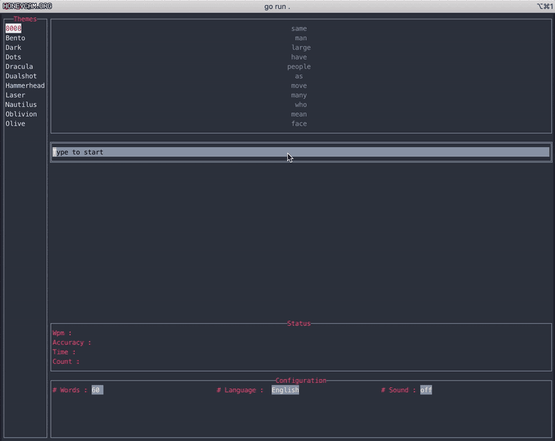

# gotypes

[](https://goreportcard.com/report/github.com/ralpioxxcs/gotypes)
[](https://github.com/ralpioxxcs/gotypes/actions?query=workflow%3A"build")

terminal based typing test application using golang inspirated by [monkeytype](https://monkeytype.com/)



## Features
* [gmk](https://www.gmk-electronic-design.de/en/products/keycaps) keycap themes
* accuracy
* live wpm

## Install
```
$ go get github.com/ralpioxxcs/gotypes
$ go build
```

## Usage
Just run `go run .` or `gotypes` in source root.  
each widgets are clickable and select widget which you want.  
In configuration widget, use <kbd>tab</kbd> key to manipulate each config.  
(full screen is recommended)

## Docker
```
docker run -it --rm -e "TERM=xterm-256color" placket/gotypes:latest
```

## Dependencies
* https://github.com/rivo/tview

## License
See [LICENSE](LICENSE) file
